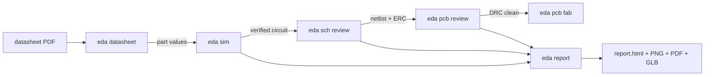
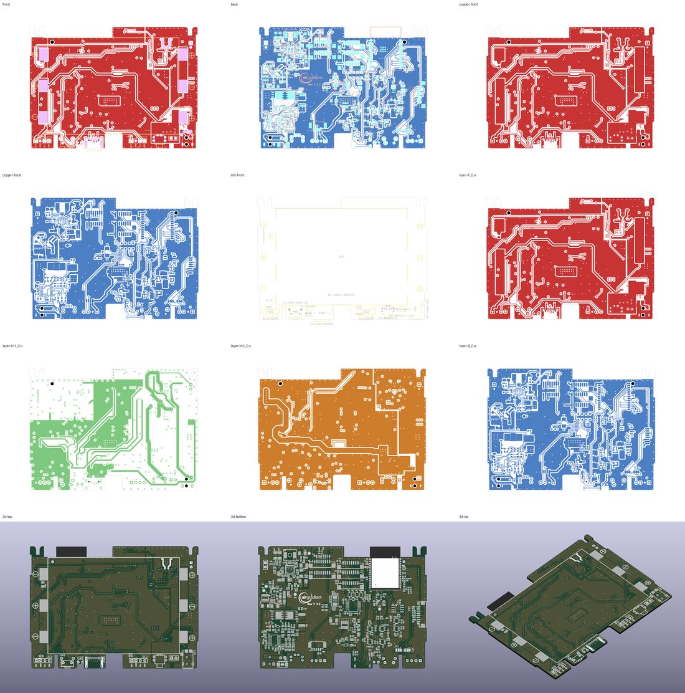
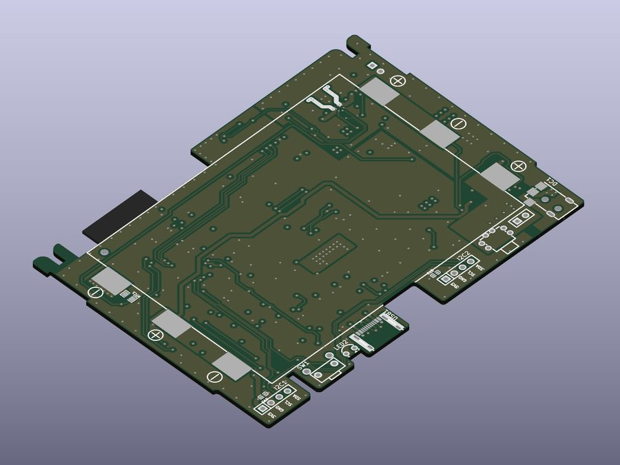
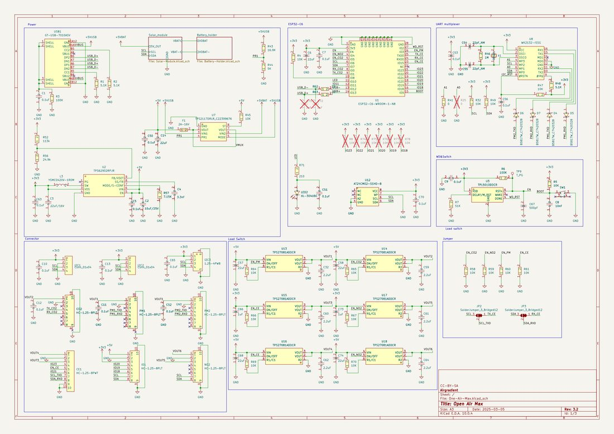
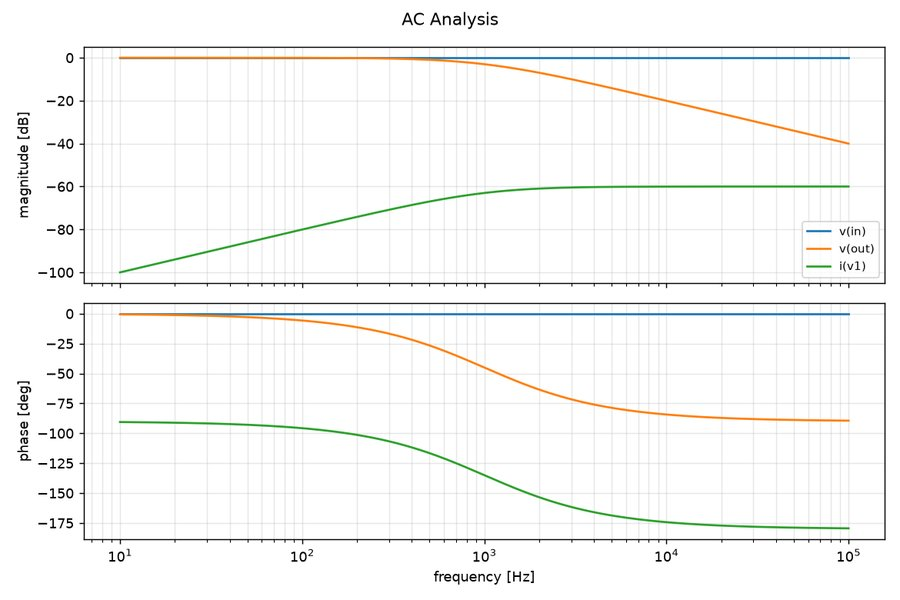
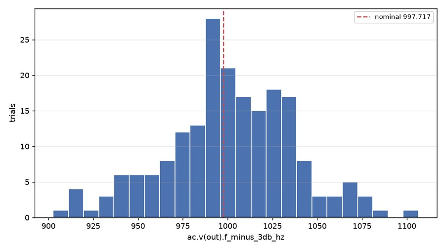

# kicad_skills — a containerised circuit-design toolkit

[](https://github.com/sabas0ba/kicad_skills/actions/workflows/ci.yml)
[](https://github.com/sabas0ba/kicad_skills/actions/workflows/pins.yml)
[](https://github.com/sabas0ba/kicad_skills/blob/main/docker/kicad-digests.txt)
[](https://github.com/sabas0ba/kicad_skills/blob/main/pyproject.toml)
[](https://github.com/sabas0ba/kicad_skills/blob/main/LICENSE)

`eda` is a command-line toolkit for circuit design work: reading datasheets,
simulating analog circuits with ngspice, reviewing KiCad schematics and PCB
artwork, and producing the fabrication package.

**Everything runs inside a container.** KiCad, ngspice and the Python
dependencies are never installed on the host — the only host requirements are
`docker` and `bash`. The KiCad release is a build argument, so it can be pinned
per project.

It is an ordinary CLI that prints JSON and exits non-zero on errors, so it works
the same from a terminal, a `Makefile`, a CI job, or a coding assistant. The
repository also ships [usage guides](docs/guides/README.md) for each area —
plain Markdown, worth reading on their own, and installable into whatever layout
your assistant expects.

```bash
./bin/eda.sh doctor                                   # builds the image on first use
./bin/eda.sh report      hardware/ -o build/report    # everything, on one page
./bin/eda.sh sch review  hardware/ --text
./bin/eda.sh pcb review  hardware/ --text
./bin/eda.sh sim run     sim/filter.cir -o sim/out
./bin/eda.sh datasheet parse docs/datasheets/lm321.pdf -o /tmp/ds
```

## Install

### Into an existing board project, as a submodule

```bash
cd ~/projects/my-board
git submodule add https://github.com/sabas0ba/kicad_skills tools/kicad_skills
./tools/kicad_skills/bin/install-skills.sh
```

That drops a one-line `bin/eda.sh` shim so the `./bin/eda.sh …` commands work
verbatim from your project root, and — for Claude Code users — links the
[usage guides](docs/guides/README.md) into the layout it discovers:

```
my-board/
├── bin/eda.sh                                    shim -> tools/kicad_skills/bin/eda.sh
├── .claude/skills/kicad-pcb-review/SKILL.md ->   ../../../tools/kicad_skills/docs/guides/kicad-pcb-review.md
├── hardware/my-board.kicad_pro
└── tools/kicad_skills/                           the submodule
```

Commit `bin/eda.sh` so everyone who clones the project gets it. Upgrading is
`git submodule update --remote` — the symlinks follow, with no re-install.

| Flag | Effect |
| --- | --- |
| `--no-guides` | just the CLI shim, nothing else |
| `--dest DIR` | another tool's directory (e.g. `--dest .cursor/rules`) |
| `--copy` | vendor the guides instead of symlinking (Windows checkouts) |
| `--force` / `--uninstall` | replace what is already there / reverse the install |

The guides themselves need no install — they are Markdown in
`tools/kicad_skills/docs/guides/`, readable as they are.

Then, from your project root:

```bash
./bin/eda.sh doctor                       # builds the image on first use (~5 min)
./bin/eda.sh report hardware/ -o build/report
```

### Or standalone

No install step is needed to try it — clone and run:

```bash
git clone https://github.com/sabas0ba/kicad_skills && cd kicad_skills
./bin/eda.sh doctor            # {"kicad_cli": "10.0.4", "ngspice": "...", "ok": true}
./bin/eda.sh report ~/projects/my-board/hardware -o /tmp/report
```

`bin/eda.sh` mounts the git repository root that contains the current directory
at `/work`, runs as your uid/gid (no root-owned files), and gives the container
no network. To work on the toolkit itself, see [AGENTS.md](AGENTS.md).

If you drive this clone with Claude Code, `make skills` mirrors the guides into
the layout it discovers. That directory is generated and git-ignored — the
guides live in [`docs/guides/`](docs/guides/README.md).

## What it does



| Area | What it does | One command | Guide |
| --- | --- | --- | --- |
| Datasheets | Text, parameter tables, embedded figures and rendered page images from a PDF | `eda datasheet parse lm321.pdf -o out/` | [guide](docs/guides/datasheet-analysis.md) |
| Simulation | ngspice op/dc/ac/tran/noise, THD, Monte Carlo tolerance analysis, temperature sweeps — with measurements and plots | `eda sim run filter.cir -o out/` | [guide](docs/guides/spice-simulation.md) |
| Schematic review | Components, nets and hierarchy from `.kicad_sch`; ERC plus decoupling / floating-input / annotation / pull-up checks | `eda sch review hardware/ --text` | [guide](docs/guides/kicad-schematic-review.md) |
| Board review | DRC, schematic parity, track widths, drills, exact board-edge clearance, ground pour, silkscreen; layer plots and 3D renders | `eda pcb review hardware/ --text` | [guide](docs/guides/kicad-pcb-review.md) |
| Fabrication | Gerbers, Excellon drill, pick-and-place, BOM, STEP/IPC-2581, zipped with a manifest | `eda pcb fab hardware/ -o fab/` | [guide](docs/guides/kicad-fabrication-output.md) |
| The container | Build, pin, verify and troubleshoot the toolchain | `eda doctor` | [guide](docs/guides/eda-environment.md) |

### Examples

**Review a board and see why** — findings are structured, so they can be
filtered, counted and gated on in CI; `--text` is the human digest.

```console
$ ./bin/eda.sh pcb review hardware/ --text
## summary: error=1, warning=3, info=4

## findings
  ERROR   board.copper_outside_outline: 46 copper item(s) lie outside the board outline
  WARNING board.edge_clearance: 2 copper item(s) within 0.3 mm of the board outline
  WARNING layout.decoupling_distance [U3.14 / +3V3]: C12 is 8.4 mm away
  INFO    board.size: board outline is 63.5 x 40.6 mm
```

Exit code is `2` when a review found errors, so `eda pcb review hardware/` is
also a CI gate; `-o report.json` keeps the structured version.

**Simulate before committing to a part value** — the −3 dB corner, the phase
margin and the tolerance spread come back as numbers, not a picture to squint at.

```console
$ ./bin/eda.sh sim montecarlo sim/rc.cir -o sim/mc \
    --vary R1=1% --vary C1=10% --metric 'ac.v(out).f_minus_3db_hz' --trials 200
{"metric": "ac.v(out).f_minus_3db_hz", "nominal_metric": 997.7,
 "statistics": {"samples": 200, "mean": 1001.1, "stdev": 35.5,
                "p05": 940.1, "median": 1000.7, "p95": 1064.0, "spread_pct": 20.4},
 "sensitivity": {"explained_pct": 99.7, "parameters": [
     {"parameter": "C1", "contribution_pct": 99.3, "elasticity": -0.99},
     {"parameter": "R1", "contribution_pct":  0.7, "elasticity": -0.96}]},
 "failures": [], "histogram": "sim/mc/histogram.png", "csv": "sim/mc/trials.csv"}
```

The 10 % capacitor is the entire spread; the 1 % resistor is noise. That is the
line item worth changing, and it came out of the trials that were already run.

**Read a datasheet without opening a viewer** — page images for the curves,
tables for the numbers.

```console
$ ./bin/eda.sh datasheet find docs/lm321.pdf "supply current"
[{"page": 3, "line": "Supply Current  IS  VS = 5 V, no load  0.43  0.75  mA"}]
$ ./bin/eda.sh datasheet pages docs/lm321.pdf -o out/ --pages 7 --dpi 200
```

**One command for the whole project** — see [the worked example](#worked-example-a-real-board)
below.

```bash
./bin/eda.sh report hardware/ -o build/report --glb
open build/report/report.html
```

## Pinning the KiCad version

```bash
KICAD_VERSION=10.0.4 make build     # default, current stable
KICAD_VERSION=9.0.9  make build     # a second image for older projects
KICAD_VERSION=9.0.9 ./bin/eda.sh pcb review board.kicad_pcb
```

Each version produces its own image tag (`eda-toolkit:<version>`) so several can
coexist. Tags: <https://hub.docker.com/r/kicad/kicad/tags>. KiCad upgrades
project files in place when it opens something older than itself, so match the
version to the project.

CI runs the **whole suite against both 10.0.4 and 9.0.9**, because "the KiCad
version is configurable" is a claim that has to be backed up. It is what caught
these, all of which are handled at runtime rather than pinned away:

* `pcb export pdf --scale`, `pcb export gerbers --check-zones`,
  `pcb drc --refill-zones` and `pcb export stats` are KiCad 10 additions. The
  wrapper asks the binary what it supports (`kicad_cli.supports`) instead of
  keeping a version table, so an untested release degrades rather than crashes.
* ngspice never initialises the imaginary half of an AC sweep's frequency
  column. ngspice 44 leaves a denormal there and taking the magnitude looks
  fine; the ngspice 39 that ships with KiCad 9 left `-1.8e199`, and every
  frequency measurement became nonsense. Only the real part is defined.

Adding a version is a digest in `docker/kicad-digests.txt` plus an entry in the
workflow matrix — `tests/test_pinning.py` fails if the two disagree.

## Worked example: a real board

Everything below is actual output from the **Open Air Max** demo project that
ships with KiCad (210 footprints, 4 layers, a 3-sheet hierarchical schematic) —
a far better test of "does this help?" than a two-resistor fixture. One command
produced all of it:

```bash
./bin/eda.sh report openair-max/ -o build/report --dpi 150 --glb
```

```
build/report/
├── report.html          the page below, self-contained
├── report.md            same content, for a PR comment or a commit message
├── report.json          every finding, machine readable
├── bom.csv
├── schematic/           schematic.pdf + one PNG per sheet + contact sheet
└── board/               6 view plots, 4 per-layer plots, 3 renders,
                         contact-sheet.png, board.glb, the PDFs behind them
```

**The board at a glance** — 13 plots and renders tiled into one image, so
"is anything on the wrong layer" is one look, not thirteen file-opens:



**3D, for the things no 2D plot shows** — connector orientation, component
collisions, which side is which. `--glb` additionally writes a `board.glb` that
GitHub and every browser render interactively:



**The schematic**, rasterised per sheet plus a real PDF (sheet 1 of 3):



**And the verdict**, abridged from `report.md` — note the collapsing: 199
identical drill violations are one line, not 199:

```markdown
## Verdict
* schematic: 3 error, 19 warning, 4 info
* board: 8 error, 26 warning, 6 info
* 99.45 x 72.0 mm, 4 layers, 210 footprints, 156 nets, 410 vias

## Board findings
| severity | rule | where | message |
| --- | --- | --- | --- |
| error   | `drc.drill_out_of_range` | 199 locations | 199 occurrences. First: Hole size out of range (min hole 0.5080 mm; actual 0.4000 mm) |
| error   | `drc.clearance`          | 13 locations  | 13 occurrences. First: Clearance violation (clearance 0.1000 mm; actual 0.0910 mm) |
| error   | `drc.zones_intersect`    | Zone [BAT-] on F.Cu, priority 5 | Copper zones intersect (must have distinct priorities) |
| warning | `drc.parity.net_conflict`| Pad 6 of I2C3 on B.Cu | Pad net doesn't match net given by schematic (GND) |
| warning | `drc.silk_edge_clearance`| 8 locations   | 8 occurrences. First: Silkscreen clipped by board edge |
```

### Simulation

The same "show, don't describe" applies to analog work. An AC sweep of the RC
reference circuit, and 200 Monte Carlo trials of the same circuit with 1 %
resistors and 10 % capacitors:

| `sim run` (AC) | `sim montecarlo` |
| --- | --- |
|  |  |

```json
{"nominal_metric": 997.7,
 "statistics": {"samples": 200, "mean": 1001.1, "stdev": 35.5,
                "p05": 940.1, "median": 1000.7, "p95": 1064.0, "spread_pct": 20.4}}
```

The 10 % capacitor sets the spread: ±1 % on the resistor barely moves it. That
is the kind of answer that changes a BOM line.

Provenance and licensing of these images: [`docs/examples/README.md`](docs/examples/README.md).

## Command reference

```
eda doctor                                    tool versions in the environment
eda report       TARGET -o DIR [--dpi 200] [--glb] [--simulation NETLIST]
                              [--no-3d] [--no-per-layer] [--no-bom] [--title T]

eda datasheet info   PDF
eda datasheet find   PDF QUERY... [--regex]
eda datasheet text   PDF [--pages 1-5] [--layout] [--ocr]
eda datasheet tables PDF [--pages 5]
eda datasheet images PDF -o DIR [--pages]
eda datasheet pages  PDF -o DIR [--pages] [--dpi 200]
eda datasheet parse  PDF -o DIR [--renders] [--ocr]

eda sim lint     NETLIST
eda sim run      NETLIST -o DIR [--no-plots] [--timeout S]
eda sim montecarlo NETLIST -o DIR --vary R1=1% --metric ac.v(out).f_minus_3db_hz [--trials N]
eda sim temperature NETLIST -o DIR [--temperatures -40 25 85] [--metric ...]
eda sim measure  RAW [--thd SIGNAL --fundamental HZ] [--skip S]
eda sim plot     RAW -o DIR [--signals ...]
eda sim netlist  SCHEMATIC -o FILE           export a SPICE deck from KiCad

eda sch info     TARGET [--no-cli]
eda sch review   TARGET [--text] [--collapse N] [-o report.json] [--no-cli]
eda sch bom      TARGET -o bom.csv [--group-by ...] [--fields ...]
eda sch erc      TARGET                      raw KiCad ERC JSON
eda sch netlist  TARGET [--format json|kicadxml|spice|...] [-o FILE]
eda sch render   TARGET -o DIR [--dpi 200]   PDF + one PNG per sheet + contact sheet
eda sch pdf      TARGET -o FILE              just the PDF

eda pcb info     TARGET
eda pcb review   TARGET [--text] [--collapse N] [--threshold KEY=VALUE] [-o report.json]
eda pcb fab      TARGET -o DIR [--step] [--ipc2581] [--pos-format csv]
eda pcb drc      TARGET [--no-parity]        raw KiCad DRC JSON
eda pcb render   TARGET -o DIR [--views ...] [--per-layer] [--no-3d] [--no-sheet]
                              [--glb] [--dpi 300]
eda pcb glb      TARGET -o FILE              3D model a browser can display
eda pcb stats    TARGET
```

`TARGET` accepts a `.kicad_sch`/`.kicad_pcb` file, a `.kicad_pro`, or a project
directory. All commands print JSON by default (the review commands also take
`--text` for a human readable digest) and exit `2` when a review found errors.

### Environment variables

| Variable | Effect |
| --- | --- |
| `KICAD_VERSION` | KiCad release / image tag to use (default `10.0.4`) |
| `EDA_IMAGE` | override the image name entirely |
| `EDA_NETWORK` | `1` gives the container network access (default: offline) |
| `EDA_MOUNT` | host directory to mount at `/work` (default: git root or `$PWD`) |
| `EDA_ENV_PASSTHROUGH` | extra environment variable names to forward |
| `EDA_DOCKER_ARGS` | extra arguments for `docker run` |

## Using it in CI

The reviews are exit-code gates, so a board can be checked on every push the way
code is. In a project that added this as a submodule:

```yaml
# .github/workflows/hardware.yml
- uses: actions/checkout@... # with: submodules: true
- name: Review the board
  run: |
    ./bin/eda.sh sch review hardware/ --text
    ./bin/eda.sh pcb review hardware/ --text
- name: Build the report
  if: always()
  run: ./bin/eda.sh report hardware/ -o build/report
- uses: actions/upload-artifact@...
  if: always()
  with: { name: hardware-report, path: build/report }
```

Exit `0` clean, `1` on a usage error, `2` when a review found errors. Loosen or
tighten what counts as an error with `--threshold KEY=VALUE`, or post-process
`report.json` if you want your own policy. This repository's own CI reviews its test
fixture and uploads the report the same way — see
[`ci.yml`](https://github.com/sabas0ba/kicad_skills/blob/main/.github/workflows/ci.yml).

Nothing needs the network at run time, so the container stays offline unless you
ask for `EDA_NETWORK=1`.

## Using it with a coding assistant

The toolkit is a CLI: any assistant that can run a shell command can drive it,
and the JSON output is meant to be parsed rather than screen-scraped. What makes
the difference in practice is not the commands but knowing how to *use* them —
which is what [`docs/guides/`](docs/guides/README.md) is for. Those guides cover
the review methodology, what each finding means, and what the tool cannot judge
for you.

* **Anything that reads a repository** — point it at `docs/guides/`, or let it
  read [`AGENTS.md`](AGENTS.md), which names them.
* **Claude Code** wants its own layout (`.claude/skills/<name>/SKILL.md`) so it
  can load a guide on demand. `bin/install-skills.sh` generates that layout from
  `docs/guides/` as symlinks — run it in this checkout or in a project that uses
  the submodule. The result is git-ignored: it is an adapter, not a second copy.
* **Some other tool** — `./bin/install-skills.sh --dest .cursor/rules --copy`.
* **No assistant at all** — they are ordinary Markdown, written to be read.

Contributor and agent instructions for this repository itself live in
[`AGENTS.md`](AGENTS.md) (`CLAUDE.md` is a pointer to it, not a second copy).

`eda report` exists largely for this use case: an assistant working headlessly
can produce one page — renders, findings, BOM, simulation plots — that a human
can check at a glance instead of taking a summary on trust.

## How it fits together

```
bin/eda.sh            host wrapper: docker run, uid mapping, network policy, path rewriting
bin/install-skills.sh CLI shim + renders docs/guides/ into an assistant's layout
docker/Dockerfile     kicad/kicad:<version> + ngspice + an isolated virtualenv
src/eda_toolkit/
├── cli.py                 the `eda` command
├── report.py              the one-command report: collect, then render md/html
├── datasheet/             PDF text, table, image and page extraction
├── spice/                 ngspice runner, raw-file parser, measurements, plots
└── kicad/                 s-expression parser, schematic/board models,
                           outline geometry, kicad-cli wrapper, review rules,
                           renderers, fabrication package
tests/                     pytest suite + fixtures + smoke test
docs/guides/               the usage guides - prose, and the source of truth
docs/examples/             committed output, so the README shows rather than tells
AGENTS.md                  contributor / agent instructions (CLAUDE.md points here)
```

Design notes:

* **KiCad is the source of truth** where it can be: ERC, DRC, netlist export
  and plotting all go through `kicad-cli`. The hand-written parsers add what
  the CLI does not expose (geometry, stackup, pad positions, properties) and
  provide a pure-python fallback so the library, and the test-suite, still work
  without KiCad installed.
* **Review = rules + pictures.** The rule engine produces structured findings;
  the renderers produce PNGs so the parts a rule cannot judge (placement,
  routing quality, silkscreen legibility, signal flow) can be looked at. This
  matters most when the work is headless: `eda report` exists so whoever is
  driving - a person on a CI artifact, or an assistant mid-task - can *see* the
  design instead of taking a JSON summary on faith.
* **Geometry is measured, not approximated.** Board-edge clearance is computed
  against the flattened Edge.Cuts geometry, arcs and circles included, with an
  inside/outside test that survives cutouts and the seams where two outlines
  meet. A bounding box gets a round board, a notch or a mounting hole wrong in
  both directions.
* **Findings are typed** (`rule`, `severity`, `message`, `location`, `details`)
  and every rule is a small function registered in a list — adding a check is a
  dozen lines plus a test.
* **The knowledge is in Markdown, not in prompts.** The judgement calls that make
  a review useful live in [`docs/guides/`](docs/guides/README.md) as prose, so
  they are reviewable in a diff and usable by a person, a script or any
  assistant. One tool's directory layout is generated from them, never the other
  way round.

## Review quality

The rules were tuned by running them over the 18 KiCad demo projects that ship
with the image (`/usr/share/kicad/demos`), which is a far harsher corpus than
the test fixture. That pass produced three fixes:

* KiCad's global library tables are now seeded from Python, not only by the
  container entrypoint. Without them every symbol reports "the current
  configuration does not include the library ...", which was 1965 findings of
  pure noise across the corpus.
* Power symbols are recognised by KiCad's real invariant - the `#` reference
  prefix - not just by a `power:` library id. Older projects were reporting
  every GND symbol as a component with no footprint.
* `net.single_pin` is graded by whether the net was named by the designer, and
  any rule that fires more than six times is folded into one finding with a
  count. On `interf_u` the review went from 113 warnings to 2.

Re-run it after changing a rule:

```bash
docker run --rm -v "$PWD:/work" -w /work -e PYTHONPATH=/work/src \
  --entrypoint python3 eda-toolkit:10.0.4 tools/review_demos.py /tmp/out
```

## Reproducibility

Every external input is pinned, and the pins are enforced by
`tests/test_pinning.py` (which runs in CI):

| Input | Pin |
| --- | --- |
| KiCad base image | manifest digest, per version, in [`docker/kicad-digests.txt`](https://github.com/sabas0ba/kicad_skills/blob/main/docker/kicad-digests.txt) |
| pip / uv | exact version + wheel SHA-256 (`ARG PIP_*`, [`docker/uv-bootstrap.txt`](https://github.com/sabas0ba/kicad_skills/blob/main/docker/uv-bootstrap.txt)) |
| Build backend | exact version in `[build-system] requires` + wheel SHA-256 in [`docker/build-backend.txt`](https://github.com/sabas0ba/kicad_skills/blob/main/docker/build-backend.txt) — `uv.lock` cannot cover it, so the image installs it separately and builds with `--no-build-isolation-package` |
| Python packages | [`uv.lock`](https://github.com/sabas0ba/kicad_skills/blob/main/uv.lock) - exact versions + artifact hashes for the whole tree, installed with `uv sync --frozen` |
| GitHub Actions | 40 character commit SHA, with the tag in a trailing comment |
| CI runner | `ubuntu-24.04`, never `-latest`; Python `3.13.5` |

Keeping them current:

* Dependabot ([`.github/dependabot.yml`](https://github.com/sabas0ba/kicad_skills/blob/main/.github/dependabot.yml)) opens weekly
  PRs for `uv.lock` and the actions.
* `make check-pins` (and the weekly [`pins.yml`](https://github.com/sabas0ba/kicad_skills/blob/main/.github/workflows/pins.yml)
  workflow) covers what Dependabot cannot parse: the KiCad image digest and the
  pip/uv bootstrap wheels. It opens a PR when upstream moved. The default KiCad
  release is never bumped automatically.

To change a dependency, edit `pyproject.toml` and regenerate the lock:

```bash
make lock          # uv lock
make rebuild
```

To use another KiCad release, add its digest to `docker/kicad-digests.txt`
(the file documents the one-liner) and build with `KICAD_VERSION=<version>`.
The build fails loudly if a version has no pinned digest.

## Testing

```bash
make test          # everything, inside the container
make test-coverage # the same, with a coverage report
make test-host     # pure-python subset on the host (needs a local venv)
make lint          # ruff
make smoke         # end-to-end: every top-level command
make skills        # mirror docs/guides/ into .claude/skills (generated)
make site          # render the GitHub Pages site into _site/
```

CI ([`.github/workflows/ci.yml`](https://github.com/sabas0ba/kicad_skills/blob/main/.github/workflows/ci.yml)) runs on every push
and pull request:

| Job | What it proves |
| --- | --- |
| `unit` | ruff (lint + format) and the pure-python suite against the hash-pinned dependency set |
| `container (KiCad 10.0.4)` | the full suite, coverage and the smoke test inside the freshly built image |
| `container (KiCad 9.0.9)` | the same, one KiCad major behind - the toolkit really is version-portable |

Both container jobs upload `eda report` output for the example project, so every
run leaves behind a page you can look at. Nothing in CI touches the network
beyond pulling the pinned base image and the locked wheels.

The suite covers the s-expression parser, schematic and board models, the
outline geometry (arcs, circles, cutouts, seams), every review rule, the
report renderers, the submodule installer, the ngspice raw-file parser
(ASCII/binary, real/complex), the
measurement maths (checked against analytically known circuits), the datasheet
PDF extraction (against a generated PDF), and the CLI. Tests that
need `kicad-cli` or `ngspice` are marked and skipped automatically outside the
container.

Integration tests run the real tools: KiCad ERC and DRC on the example project,
a deliberately introduced short to prove DRC catches it, netlist comparison
between `kicad-cli` and the fallback extractor, layer/3D rendering, and an RC
filter whose simulated −3 dB corner is compared against `1/(2πRC)`.

## Limitations

* Getting datasheet PDFs is out of scope - the container has no network. Save
  the PDF into the repository first, then parse it.
* Embedded-image extraction only recovers raster images. Most datasheet figures
  are vector art — render the page instead (`datasheet pages`).
* `sim netlist` (KiCad → SPICE) only produces a usable deck when the schematic
  carries Spice model fields.
* The review rules encode common practice, not your fab's or your project's
  rules. Thresholds are adjustable (`--threshold`); the defaults are
  conservative low-cost-fab values.
* OCR of scanned datasheets needs `tesseract`, installed only if a Debian mirror
  is reachable at build time (`WITH_OCR=0` to skip). Everything else works
  without it.
